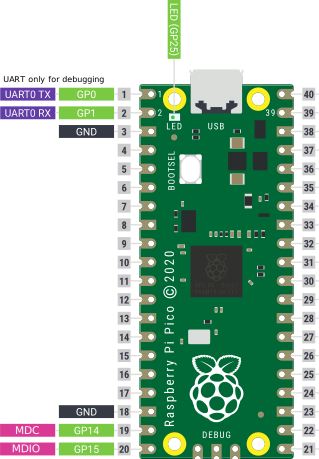

# Generic USB to MDIO adapter
This is an open source clone of a Marvell MDIO USB adapter which can be used to interface MDIO of Ethernet switch chips and PHYs. Mainline Linux kernel is there is as interface hardware a Raspberry Pi Pico 1 is used.


## Features
* Generic interface to MDIO Ethernet switch chips and Ethernet PHYs
* Mainline Linux kernel support due [mvusb driver](https://elixir.bootlin.com/linux/v6.12.6/source/drivers/net/mdio/mdio-mvusb.c)
  * Interfacing the Linux MDIO subsystem
  * Usage of tools like `mdio-tools` (https://github.com/wkz/mdio-tools)
  * Interfacing Linux [DSA](https://docs.kernel.org/networking/dsa/dsa.html) and [switchdev](https://docs.kernel.org/networking/switchdev.html)
  * Works out of the box on Ubuntu 24.04
* Implements a Marvell MDIO USB adapter clone
* A LED is indicating USB/MDIO traffic
* Raspberry Pi Pico 1 support (RP2040)


## Usage
Wire up the `MDC` and `MDIO` pins to your chip. Please note that the RP2040 uses a 3.3 V voltage level.



#### MDIO pin connection table
| Pin      | GPIO    | Function |
| -------- | ------- | -------- |
| 18       | -       | Ground   |
| 19       | GP14    | MDC      |
| 20       | GP15    | MDIO     |

The UART ports (8N1, baud. 115200) are just for debugging. The RAW MDIO data is visible there.

#### LED
The Raspberry Pi Pico has an built-in LED with the following function.

| State    | Function         |  
| -------- | ---------------- |
| On       | USB initialized  |
| Off      | USB error        |
| blinking | USB/MDIO traffic |

#### Realtek RTL8305CS example with `mdio-tools`
You can get `mdio-tools` here https://github.com/wkz/mdio-tools

*Get link status*
   ```
$ mdio mvusb*
 DEV      PHY-ID  LINK
0x00  0x001cc852  down
0x01  0x001cc852  down
0x02  0x001cc852  up
0x03  0x001cc852  down
0x04  0x001cc852  down
0x05  0x001cc852  down
   ```

*Get PHY2 information*
   ```
$ mdio mvusb* phy 2
BMCR(0x00): 0x3100
  flags: -reset -loopback +aneg-enable -power-down -isolate -aneg-restart
         -collision-test
  speed: 100-full

BMSR(0x01): 0x786d
  capabilities: -100-t4 +100-tx-f +100-tx-h +10-t-f +10-t-h -100-t2-f -100-t2-h
  flags:        -ext-status +aneg-complete -remote-fault +aneg-capable +link
                -jabber +ext-register

ID(0x02/0x03): 0x001cc852
   ```

## Installation
Download `usb-mdio-adapter.uf2` from the [latest release](https://github.com/AlbrechtL/usb-mdio-adapter/releases).

Push and hold the BOOTSEL button as you plug the debugger device into your computer to mount a volume called "RPI-RP2".

Copy the UF2 file `usb-mdio-adapter.uf2` onto the volume. The volume will dismount automatically after the file finishes copying onto the device.

Your device will reboot and now runs the USB to MDIO adapter firmware. 

Check your kernel log (e.g. `dmesg)` you should see
   ```
[  +3,286310] usb 1-2: new full-speed USB device number 49 using xhci_hcd
[  +0,152680] usb 1-2: New USB device found, idVendor=1286, idProduct=1fa4, bcdDevice= 0.00
[  +0,000017] usb 1-2: New USB device strings: Mfr=1, Product=2, SerialNumber=0
[  +0,000007] usb 1-2: Product: Marvell USB MDIO Adapter Clone
[  +0,000006] usb 1-2: Manufacturer: Albrecht Lohofener
   ```

It is now ready.

## Building
Please follow the SDK installation instructions for the Raspberry Pi Pico. Checkout this repository open Visual Studio Code and compile it.

## Support
Just raise up an [issue](https://github.com/AlbrechtL/usb-mdio-adapter/issues).
